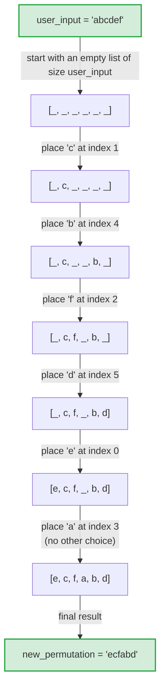

# All-Permutations

A console-based project of two different types of Permutation Generator algorithms performed on a given word.

Both algorithms are written in Python, Java, and C++ to allow users to compare the performance in these programming languages.

## What is a Permutation Generator?

A permutation generator is an algorithm that lists every possible order for a group of items.

In the case of this project, the items that are being used for this process are letters from a user-given word.

## The algorithm types that are being compared:

- [Random sampling](#how-the-random-sampling-algorithm-works)

- [Lexicographical ordering](#how-the-lexicographical-algorithm-works)

## General overview of how both algorithms work

The algorithm begins by prompting the user to enter a word of their choice and calculates the number of permutations that can be produced using the word, factoring in repeated letters before starting the main loop inside the `permutation_generator()` function which is the most taxing section of the whole algorithm.

Within the main loop it starts to generate permutations of the word provided and ends when all unique permutations have been discovered. Once all permutations have been found, a timer displays how long the algorithm took to finish.

The timer strictly measures the `permutation_generator()` function and does not include the time it takes for the program to calculate the number of permutations or how long it takes for all permutations to be printed to the console.

## How the Random Sampling algorithm works

lorem ipsum dolor sit amet consectetur adipiscing elit ipsum anim dolore excepturi autem non et id qui ut quos omnis laboris qui sint sunt et officia et animi amet cillum ullamco laboris excepturi aut pariatur placeat nisi rerum quo minus nostrud praesentium et nisi voluptate rerum laborum repellendus consequatur animi

## How the Lexicographical algorithm works

lorem ipsum dolor sit amet consectetur adipiscing elit ipsum anim dolore excepturi autem non et id qui ut quos omnis laboris qui sint sunt et officia et animi amet cillum ullamco laboris excepturi aut pariatur placeat nisi rerum quo minus nostrud praesentium et nisi voluptate rerum laborum repellendus consequatur animi

## License

This project is licensed under the MIT License — see [LICENSE](LICENSE) for details.

Credit is appreciated but not required.
