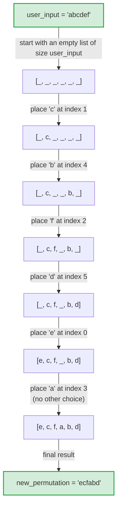
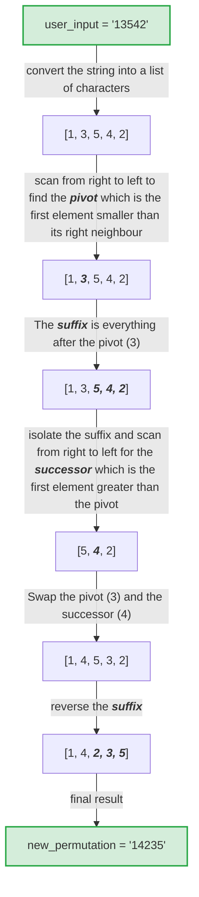

# All-Permutations

A console-based project of two different types of Permutation Generator algorithms performed on a given word.

Both types of algorithms are written in Python, Java, and C++ to allow users to compare the performance in these programming languages.

## Installation & Running

This project is implemented in three languages: Python, Java, and C++. Each is fully self-contained since there are no external dependencies beyond the language's standard library.

### Python

**Requirements:** Python 3.10 or later

```bash
# Run
python3 Rejection_Sampling_PG.py
```

or

```bash
# Run
python3 Lexicographical_PG.py
```

No `pip install` needed — the script only uses the standard library (`math`).

---

### Java

**Requirements:** JDK 17 or later

```bash
# Compile
javac Rejection_Sampling_PG.java

# Then run
java Rejection_Sampling_PG
```

or

```bash
# Compile
javac Lexicographical_PG.java

# Then run
java Lexicographical_PG
```

---

### C++

**Requirements:** A C++20-compatible compiler (GCC 13+, Clang 17+, or MSVC 19.29+) is needed.

```bash
# Compile
g++ -std=c++20 Rejection_Sampling_PG.cpp -o Rejection_Sampling_PG

# Then run
.\Rejection_Sampling_PG
```

or

```bash
# Compile
g++ -std=c++20 Lexicographical_PG.cpp -o Lexicographical_PG

# Then run
.\Lexicographical_PG
```

There is also an additional C++ file that has the same rejection-sampling algorithm but uses multi-threading.

This splits the random-generation attempts across threads to search for missing permutations in parallel.

```bash
# Compile
g++ -std=c++20 Rejection_Sampling_PG_threaded.cpp -o Rejection_Sampling_PG_threaded

# Then run
.\Rejection_Sampling_PG_threaded
```

> **Note:** On Windows with MSVC, use `cl /std:c++20 Lexicographical_PG.cpp` or equivalent for a different C++ file instead.

---

### Usage

All three versions behave identically:

1. Run the program.
2. Enter a word when prompted (all characters are accepted).
3. The program prints the total number of unique permutations, generates them all in random or lexicographical order, and prints the result along with the time taken.

> **Warning:** Words with many unique characters grow permutation counts factorially (e.g. a 10-character word with no repeats has 3,628,800 permutations). Very long or highly varied input may take a long time and use significant memory.

## What is a Permutation Generator?

A permutation generator is an algorithm that lists every possible order for a group of items.

In the case of this project, the items that are being used for this process are letters from a user-given word.

## The algorithm types that are being compared:

- [Rejection-sampling](#how-the-rejection-sampling-algorithm-works)

- [Lexicographical ordering](#how-the-lexicographical-algorithm-works)

## General overview of how both algorithms work

The algorithm begins by prompting the user to enter a word of their choice and calculates the number of permutations that can be produced using the word, factoring in repeated letters before starting the main loop inside the `permutation_generator()` function which is the most taxing section of the whole algorithm.

Within the main loop it starts to generate permutations of the word provided and ends when all unique permutations have been discovered.

When this is the case, a timer displays how long the algorithm took to finish.

This timer strictly measures the `permutation_generator()` function and does not include the time it takes for the program to calculate the number of permutations or how long it takes for all permutations to be printed to the console.

## How the rejection-sampling algorithm works

The rejection-sampling algorithm starts with an empty list with the same number of elements as there are in the user's word.

The algorithm then uses a dictionary (map) to keep track of the characters in the user's word as well as the number of times each character appears.

On each loop, elements are randomly selected from the dictionary and inserted into random indexes in the empty list.

When the empty list is completely full, it is converted into a string and inserted into a set as a new permutation. 

See the flowchart below for a visual example of the rejection-sampling algorithm.

---

### Rejection-sampling example:



## How the lexicographical algorithm works

From a given word, the lexicographical algorithm converts the string into a main list of characters. This main list is then scanned from right to left to locate a pivot.

A pivot is found if the element currently being scanned is lexicographically smaller than its right neighbour.

Using this pivot element a suffix can be defined as a sublist of elements from the main list. This suffix consists of all elements after the pivot.

From the suffix, a successor element can be determined by scanning the suffix from right to left and finding the first element that is greater than the pivot element.

When a successor element has been found, it is swapped with the pivot element and the suffix is reversed, resulting in the new permutation.

> **Note:** Before the main loop begins, the user's word must be sorted in ascending order otherwise all permutations will not be discovered. This is due to the nature of the algorithm using all elements being sorted in ascending order as the starting permutation, and all elements being sorted in descending order as the ending permutation. This also means that the lexicographical algorithm does not produce duplicate permutations as the rejection-sampling algorithm does. As a result, all source files use either a Timsort or Introsort algorithm on the user's word before discovering all permutations.

See the flowchart below for a visual example of the lexicographical algorithm. In the example, the user input is not sorted in ascending order for illustrative purposes.

---

### Lexicographical example:



## License

This project is licensed under the MIT License — see [LICENSE](LICENSE) for details.

Credit is appreciated but not required.
